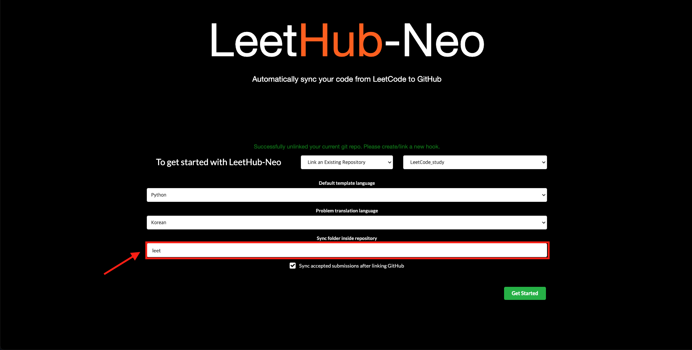
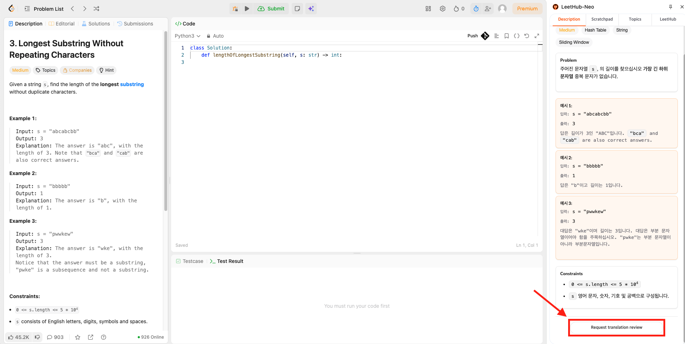

<div align="center">
    
</div>

<p align="center">
  <a href="https://github.com/legojeon/LeetHub-Neo/blob/main/LICENSE">
    
  </a>
  <a href="https://chromewebstore.google.com/detail/leethub-neo/egbdcojidgchchkfmglgcahhmlncfcbj?hl=ko">
    
  </a>
  <a href="https://chromewebstore.google.com/detail/leethub-neo/egbdcojidgchchkfmglgcahhmlncfcbj?hl=ko">
    
  </a>
</p>

<p align="center">
  <a href="README.md">English</a> | <strong>한국어</strong>
</p>

## LeetHub-Neo란?

LeetHub-Neo는 LeetCode 풀이 기록을 GitHub에 정리하기 위한 Chrome 확장
프로그램입니다. Accepted 제출을 자동으로 동기화하고, 문제 풀이 중 사용할
수 있는 사이드 패널을 제공하며, 풀이 기록을 노트, 토픽 인덱스, 템플릿,
저장소 폴더 설정, 선택적 README 자동화, 문제 설명 번역이 포함된 검색 가능한
학습 공간으로 만들어 줍니다.

LeetHub-Neo는 [LeetCode.com](https://leetcode.com/)과
[LeetCode.cn](https://leetcode.cn/)을 모두 지원합니다.

LeetHub-Neo는 [LeetHub-3.0](https://github.com/raphaelheinz/LeetHub-3.0)을
기반으로 한 fork이며, 이 프로젝트를 위한 추가 기능과 유지보수가 포함되어
있습니다.

## 1.1.0 업데이트

- LeetHub-Neo가 생성하는 파일을 선택한 저장소 폴더 아래에 모을 수 있도록
  동기화 폴더 설정을 추가했습니다.
- 문제와 토픽 동기화는 유지하면서 루트 `README.md` 자동 업데이트만 끌 수
  있는 옵션을 추가했습니다.
- LeetTranslate 조회, Chrome Translator fallback, 대상 언어 선택, 로딩 표시,
  번역 검토 요청을 포함한 개선된 문제 설명 번역 흐름을 추가했습니다.
- 문제 다이어그램이 Description 탭에서 원래 순서와 비율을 유지하도록 이미지
  렌더링을 개선했습니다.
- 영어/한국어 README 문서를 업데이트했습니다.

## 설치

Chrome Web Store에서 LeetHub-Neo를 설치하세요:

<p>
  <a href="https://chromewebstore.google.com/detail/leethub-neo/egbdcojidgchchkfmglgcahhmlncfcbj?hl=ko">
    
  </a>
</p>

이 저장소를 받아 unpacked extension으로 직접 설치할 수도 있습니다.

### 수동 설치

1. 이 저장소를 clone하거나
   [Releases](https://github.com/legojeon/LeetHub-Neo/releases)에서 ZIP을
   다운로드합니다.
2. `chrome://extensions`를 엽니다.
3. **Developer mode**를 켭니다.
4. **Load unpacked**를 클릭합니다.
5. 루트 `LeetHub-Neo` 폴더를 선택합니다.

로컬 unpacked 설치에는 별도 build 단계가 필요하지 않습니다.

## 사용 방법

1. LeetHub-Neo를 설치하고 확장 프로그램 또는 사이드 패널을 엽니다.
2. GitHub로 인증합니다.
3. 기존 저장소를 연결하거나 새 저장소를 만듭니다.
4. 필요하다면 LeetHub-Neo 파일을 둘 동기화 폴더를 설정합니다.
5. LeetCode 문제를 열고 평소처럼 풉니다. Accepted 제출 후에는 LeetHub-Neo
   동기화가 끝날 때까지 에디터를 바꾸거나 페이지를 떠나지 않는 것이 좋습니다.
6. LeetHub 설정의 **Sync Previous**로 설치/설정 전에 해결한 Accepted 제출을
   가져올 수 있습니다.
7. 풀이 중 사이드 패널 탭을 활용합니다:
   - **Description**: 문제 설명, 선택적 번역, 다이어그램, 번역 검토 요청
     버튼을 확인합니다.
   - **Scratchpad**: 자유롭게 풀이 노트를 작성합니다. 동기화된 scratchpad는
     문제 폴더의 `memo.txt`로 저장됩니다.
   - **Topics**: 토픽 노트, 관련 solved 문제, 재사용 템플릿을 확인합니다.
   - **LeetHub**: 진행 상황, 이전 제출 동기화, 저장소 설정을 관리합니다.

### 동기화 폴더

LeetHub-Neo가 저장소 루트가 아닌 특정 경로에 파일을 쓰도록 하고 싶다면
동기화 폴더를 사용하세요. 예를 들어 폴더를 `LeetCode`로 설정하면 생성 파일은
`LeetCode/` 아래에 저장됩니다.

<p align="center">
  
  <br>
  <sub>LeetHub 설정의 동기화 폴더 설정</sub>
</p>

예시 구조:

```text
LeetCode/
  README.md
  Easy/
    0001-two-sum/
      README.md
      two-sum.py
      memo.txt
  Medium/
    0002-add-two-numbers/
      README.md
      add-two-numbers.py
      memo.txt
      Solution.md
  Topics/
    array/
      README.md
      problems.json
      templates.json
      templates/
        python/
          prefix_sum.py
```

정확한 문제 폴더 구조는 난이도 폴더, 언어 폴더, 타임스탬프, Solution 글
업로드 설정에 따라 달라질 수 있습니다.

### README 동기화 끄기

**Auto update root README**를 끄면 LeetHub-Neo는 accepted solution, scratchpad
노트, 토픽 파일, 문제 메타데이터는 계속 동기화하지만 생성된 루트 `README.md`
요약은 다시 쓰지 않습니다. 저장소 README를 직접 관리하고 싶을 때 사용하세요.

### 번역 언어

LeetHub 설정에서 **Translation Language**를 펼쳐 Description 탭에서 사용할
언어를 선택할 수 있습니다. LeetHub-Neo는 39개 대상 언어를 지원합니다.
번역은 먼저 LeetTranslate API에 저장된 번역을 요청하고, 서버가 사용할 수 없거나
저장된 번역이 없으면 Chrome 내장 Translator API로 fallback합니다.

번역된 문장이 어색하면 Description 탭의 **Request translation review**를
클릭하세요. 요청은 LeetTranslate 검토 큐로 전송되어 나중에 확인할 수 있습니다.

<p align="center">
  
  <br>
  <sub>Description 탭에서 번역 검토 요청 보내기</sub>
</p>

## 스크린샷

사이드 패널은 LeetCode 문제 페이지 안에서 주요 학습 흐름을 제공합니다:
진행 상황 대시보드, 풀이 노트, 토픽 작업 공간, 동기화 설정, 번역된 문제
설명을 확인할 수 있습니다.

<table>
  <tr>
    <td align="center">
      
      <br>
      <sub>대시보드와 최근 진행 상황</sub>
    </td>
    <td align="center">
      
      <br>
      <sub>사용자 노트</sub>
    </td>
  </tr>
  <tr>
    <td align="center">
      
      <br>
      <sub>토픽 작업 공간과 템플릿</sub>
    </td>
    <td align="center">
      
      <br>
      <sub>저장소 설정</sub>
    </td>
  </tr>
</table>

## 기능

- **GitHub 자동 동기화**: Accepted LeetCode 제출을 선택한 GitHub 저장소로
  업로드합니다.
- **동기화 폴더 설정**: `LeetCode/` 또는 `algorithm/leetcode/` 같은 저장소
  경로를 지정해 LeetHub-Neo 파일을 해당 폴더 아래에 정리할 수 있습니다.
- **README 동기화 제어**: 저장소 요약 README를 직접 관리하고 싶다면 루트
  `README.md` 자동 업데이트를 끌 수 있습니다.
- **LeetCode 사이드 패널**: 문제 풀이 흐름을 벗어나지 않고 문제 페이지 옆에서
  LeetHub-Neo를 사용할 수 있습니다.
- **문제 설명 번역**: LeetTranslate 서버 조회를 먼저 시도하고 Chrome 내장
  Translator API를 fallback으로 사용해 영어 문제 설명을 39개 선택 가능 언어로
  번역합니다.
- **번역 검토 요청**: 번역이 어색하면 Description 탭의
  **Request translation review** 버튼으로 검토 요청을 보낼 수 있습니다.
- **Scratchpad**: 사이드 패널에서 풀이 노트를 작성하고 각 문제 폴더의
  `memo.txt`로 동기화할 수 있습니다.
- **토픽 작업 공간**: 문제의 토픽 태그를 보고, 토픽 노트를 만들고, 관련 풀이
  문제를 `Topics/` 아래에 모을 수 있습니다.
- **재사용 가능한 템플릿**: C++, Java, JavaScript, Lua, Python, Ruby용 알고리즘
  및 자료구조 템플릿으로 토픽 폴더를 시작할 수 있습니다.
- **이전 제출 동기화**: LeetHub-Neo 설치 또는 설정 전에 해결한 Accepted
  제출도 가져올 수 있습니다.
- **저장소 구성 옵션**: 난이도 폴더, 언어 폴더, 타임스탬프 파일명, 커스텀
  커밋 메시지, 공개 Solution 글의 `Solution.md` 업로드를 설정할 수 있습니다.
- **진행 상황 대시보드**: solved 수, 난이도 분포, 풀이 날짜, 최근 활동,
  streak, 그래프, 상위 태그를 LeetHub 패널에서 확인할 수 있습니다.

## 번역 요구 사항

문제 번역은 LeetCode 문제 설명 HTML을 `https://leettranslate.coco.io.kr/`로
보내 저장된 번역이 있는지 확인합니다. 서버를 사용할 수 없거나 아직 저장된
번역이 없으면, 사용자의 브라우저가 지원하는 경우 Chrome 내장 Translator API로
fallback합니다.

Chrome fallback 지원 여부는 Chrome 버전, 프로필, 언어 쌍, 로컬 모델 사용
가능 여부에 따라 달라집니다. 서버 번역과 Chrome fallback이 모두 불가능하면
LeetHub-Neo는 사이드 패널에 제한 사항을 표시하고 나머지 기능은 계속 사용할 수
있게 합니다.

## 저장소 구조

LeetHub-Neo는 기존 LeetHub 스타일의 문제 폴더를 유지할 수도 있고, 동기화 폴더,
난이도 폴더, 언어 폴더를 조합해 제출을 정리할 수도 있습니다.

토픽 기능은 다음과 같은 학습 중심 구조를 만듭니다:

```text
Topics/
  array/
    README.md
    problems.json
    templates.json
    templates/
      python/
        prefix_sum.py
```

README 동기화를 끄지 않았다면 생성된 루트 `README.md`가 토픽별 solved 문제를
요약할 수 있습니다.

## 향후 아이디어

- [ ] **Notion 및 Obsidian 워크플로우**: 토픽 노트는 이미 Markdown 파일로
      저장됩니다. 앞으로 자동 hook, action, 저장소와 지식 베이스 연동 등으로
      더 자연스러운 Notion/Obsidian 워크플로우를 확장할 수 있습니다.
- [ ] **Scratchpad whiteboard**: 현재 scratchpad는 텍스트 중심입니다. 향후에는
      자료구조, 다이어그램, 설명 스케치를 위한 드로잉 도구를 기존 scratchpad
      흐름과 통합할 수 있습니다.
- [ ] **Big-O notation helper**: solution을 작성하는 동안 시간/공간 복잡도를
      추정하거나 표시하는 helper를 추가할 수 있습니다.

## 프로젝트 방향: AI와 플랫폼

LeetHub-Neo는 LeetCode에 집중합니다. LeetCode는 이미 큰 문제 세트, 좋은
editorial 및 커뮤니티 자료, 강한 사용자 기반을 가지고 있으므로 현재는 다른
코딩 플랫폼으로 확장할 계획이 없습니다.

또한 풀이 흐름 안에 AI 챗봇을 직접 넣는 것에는 신중합니다. 알고리즘 연습은
논리, 인내, 독립적인 문제 해결 능력을 기르는 과정이기 때문입니다. 내장 챗봇은
쉽게 그 학습 루프를 약하게 만드는 지름길이 될 수 있습니다. AI 도움이 필요할
때는 먼저 스스로 충분히 고민하고, 막혔거나 문제를 해결한 뒤 리뷰가 필요할 때
ChatGPT, Gemini 또는 다른 AI 도구를 사용하는 흐름을 권장합니다.

## 지원하는 LeetCode UI

LeetHub-Neo는 LeetCode의 old layout과 newer dynamic layout을 대상으로
설계되었습니다. LeetCode가 페이지 구조를 자주 바꾸기 때문에 non-dynamic
layout에는 여전히 문제가 있을 수 있습니다.

## 개발

```bash
npm run               # 사용 가능한 명령 표시
npm run setup         # 의존성 설치
npm run format        # JavaScript, HTML/CSS 자동 포맷
npm run format-test   # 포맷 검사
npm run lint          # JavaScript lint 및 자동 수정
npm run lint-test     # lint 규칙 검사
npm run test:unit     # 단위 테스트 실행
```

## 선택적 GitHub OAuth 설정

unpacked extension은 새 OAuth app을 만들지 않아도 로드할 수 있습니다. 직접
fork를 준비하거나 확장 프로그램에서 사용하는 GitHub OAuth app을 교체하려면
[github.com/settings/applications/new](https://github.com/settings/applications/new)에서
OAuth app을 만드세요.

다음 값을 사용합니다:

- **Application name**: 원하는 이름, 예: `LeetHub-Neo Local`
- **Homepage URL**: `https://github.com/legojeon/LeetHub-Neo`
- **Authorization callback URL**: `https://github.com/`

그 다음 아래 파일의 OAuth 상수를 수정합니다:

- `src/js/authorize.js`
- `src/js/oauth2.js`

개인 OAuth app의 실제 client secret은 커밋하지 마세요.

## 감사의 말

LeetHub-Neo는 [LeetHub-3.0](https://github.com/raphaelheinz/LeetHub-3.0)과
LeetHub 프로젝트 계열의 작업을 기반으로 합니다.

토픽 템플릿 카탈로그는
[leetcode-cheatsheet](https://github.com/jwl-7/leetcode-cheatsheet)를 참고해
구성했습니다. 템플릿은 LeetHub-Neo가 사용자의 GitHub 저장소에 토픽 학습 파일을
직접 생성할 수 있도록 함께 제공됩니다.

Topics 패널의 syntax highlighting은 bundled
[PrismJS](https://github.com/PrismJS/prism) v2를 사용하며, bundled template
catalog에서 사용하는 언어로 범위를 제한합니다. 자세한 내용은
`src/vendor/prism-v2/README.md`와 `src/vendor/prism-v2/LICENSE`를 확인하세요.

함께 제공되는 third-party license notice는 `THIRD_PARTY_NOTICES.md`를
확인하세요.

## 기여

이슈와 pull request를 환영합니다. 기능 요청은 `feature` label로 이슈를 열거나,
LeetHub-Neo가 지원했으면 하는 사용 사례를 discussion으로 남겨 주세요.
