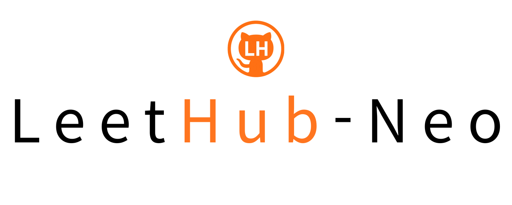
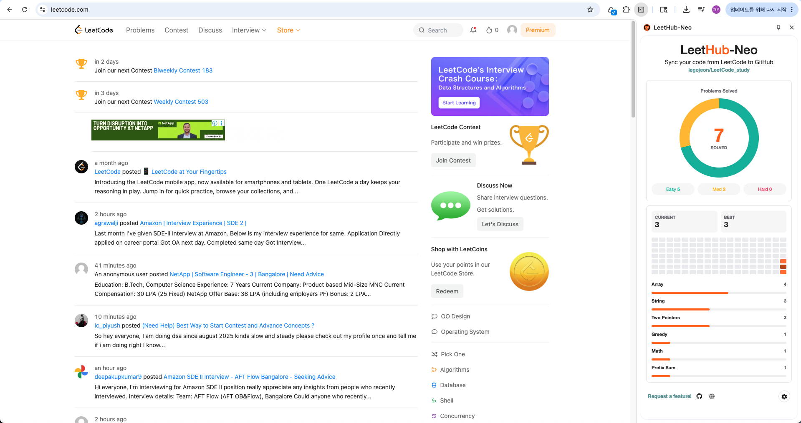
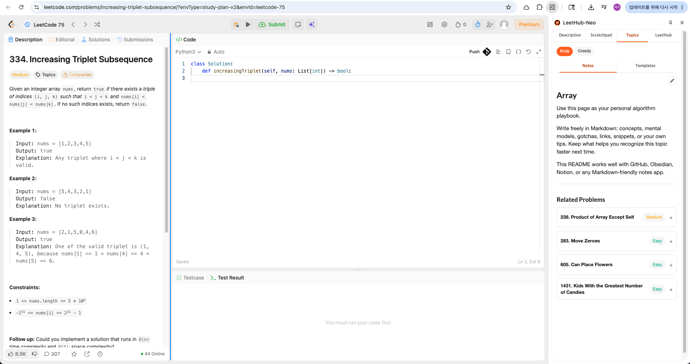
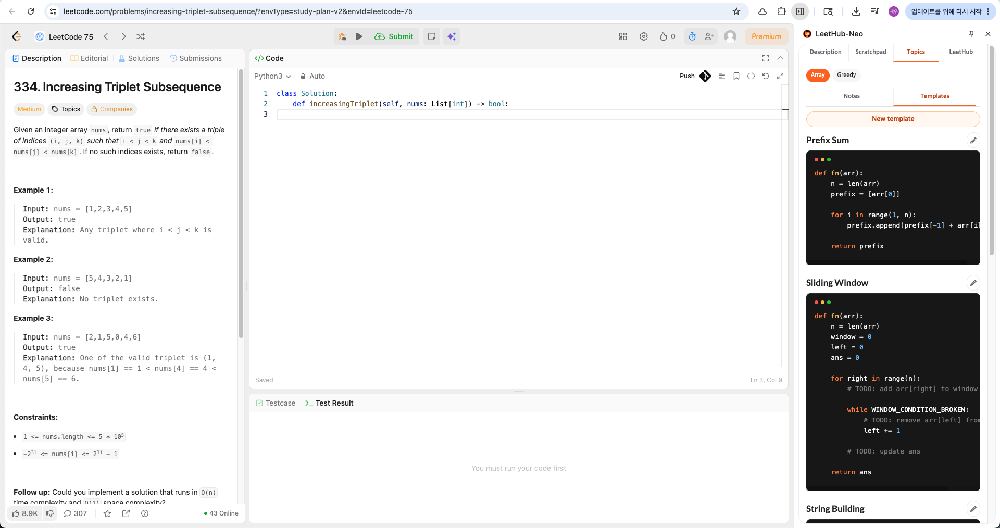
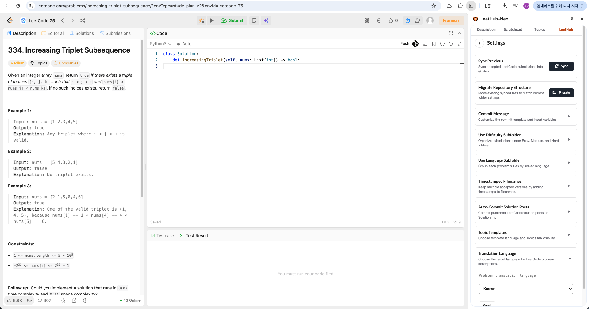

<div align="center">
    
</div>

<p align="center">
  <a href="https://github.com/legojeon/LeetHub-Neo/blob/main/LICENSE">
    
  </a>
  <a href="https://chromewebstore.google.com/detail/leethub-neo/egbdcojidgchchkfmglgcahhmlncfcbj?hl=ko">
    
  </a>
  <a href="https://chromewebstore.google.com/detail/leethub-neo/egbdcojidgchchkfmglgcahhmlncfcbj?hl=ko">
    
  </a>
</p>

## What is LeetHub-Neo?

LeetHub-Neo is a Chrome extension for keeping your LeetCode practice organized in
GitHub. It syncs accepted submissions automatically, gives you a side panel while
you solve problems, and helps turn solved problems into a searchable study space
with notes, topic indexes, templates, and optional translated problem statements.

LeetHub-Neo supports both [LeetCode.com](https://leetcode.com/) and
[LeetCode.cn](https://leetcode.cn/).

LeetHub-Neo is a fork of
[LeetHub-3.0](https://github.com/raphaelheinz/LeetHub-3.0), with additional
features and maintenance for this project.

## Screenshots

The side panel brings the main study workflow into the LeetCode problem page:
dashboard progress, solve notes, topic workspaces, and sync settings.

<table>
  <tr>
    <td align="center">
      
      <br>
      <sub>Dashboard and recent progress</sub>
    </td>
    <td align="center">
      
      <br>
      <sub>User notes</sub>
    </td>
  </tr>
  <tr>
    <td align="center">
      
      <br>
      <sub>Topic workspace and templates</sub>
    </td>
    <td align="center">
      
      <br>
      <sub>Repository sync settings</sub>
    </td>
  </tr>
</table>

## Features

- **Automatic GitHub sync**: push accepted LeetCode submissions to your selected
  GitHub repository.
- **LeetCode side panel**: open LeetHub-Neo beside the problem page without
  leaving your current solve flow.
- **Problem description translation**: translate English problem descriptions
  with Chrome's built-in Translator API in supported Chrome versions.
- **Scratchpad**: keep solve notes in the side panel and sync them as `memo.txt`
  inside each problem folder.
- **Topic workspace**: browse a problem's topic tags, create topic notes, and
  keep related solved problems grouped under `Topics/`.
- **Reusable templates**: seed topic folders with algorithm and data-structure
  templates for C++, Java, JavaScript, Lua, Python, and Ruby.
- **Previous submission sync**: import accepted submissions that were solved
  before installing or configuring LeetHub-Neo.
- **Repository organization options**: choose difficulty folders, language
  folders, timestamped filenames, custom commit messages, and automatic
  `Solution.md` uploads for published solution posts.
- **Progress dashboard**: review solved counts, difficulty distribution, solved
  study days, recent activity, streaks, graphs, and top tags from the LeetHub
  panel.

## Installation

Install LeetHub-Neo from the Chrome Web Store:

<p>
  <a href="https://chromewebstore.google.com/detail/leethub-neo/egbdcojidgchchkfmglgcahhmlncfcbj?hl=ko">
    
  </a>
</p>

You can also install it manually as an unpacked extension from this repository.

### Manual installation

1. Clone this repository or download a ZIP from
   [Releases](https://github.com/legojeon/LeetHub-Neo/releases).
2. Open `chrome://extensions`.
3. Enable **Developer mode**.
4. Click **Load unpacked**.
5. Select the root `LeetHub-Neo` folder.

No build step is required for a local unpacked install.

## How to Use

1. Install LeetHub-Neo and open the extension or side panel.
2. Authenticate with GitHub.
3. Link an existing repository or create a new one.
4. Open a LeetCode problem and solve it normally. After an accepted submission,
   wait for LeetHub-Neo to finish syncing before changing the editor or leaving
   the page.
5. Use **Sync Previous** in LeetHub settings if you want to import accepted
   submissions that were solved before installing or configuring LeetHub-Neo.
6. Use the side panel tabs while solving:
   - **Description**: view the problem statement and optional translation.
   - **Scratchpad**: write free-form solve notes; synced scratchpad content is
     saved as `memo.txt` in the problem folder.
   - **Topics**: browse topic notes, related solved problems, and reusable
     templates.
   - **LeetHub**: review progress, sync previous submissions, and change
     repository settings.

### Translation language

Open LeetHub settings and expand **Translation Language** to choose the language
used by the Description tab. Translation uses Chrome's built-in Translator API,
so availability depends on your Chrome version, profile, language pair, and
local model availability.

### Optional local development setup

Install npm dependencies only if you want to run formatting, linting, or tests:

```bash
npm run setup
```

### Optional GitHub OAuth setup

The unpacked extension can be loaded without creating a new OAuth app. If you
are preparing your own fork or replacing the GitHub OAuth app used by the
extension, create an OAuth app at
[github.com/settings/applications/new](https://github.com/settings/applications/new).

Use these values:

- **Application name**: any name you want, such as `LeetHub-Neo Local`
- **Homepage URL**: `https://github.com/legojeon/LeetHub-Neo`
- **Authorization callback URL**: `https://github.com/`

Then update the OAuth constants in:

- `src/js/authorize.js`
- `src/js/oauth2.js`

Do not commit real client secrets from a personal OAuth app.

## Translation Requirements

Problem translation uses Chrome's built-in Translator API. It does not send text
through a custom LeetHub-Neo translation server. Chrome 138+ desktop is expected
for this feature.

Translation availability depends on your Chrome version, profile, language pair,
and local model availability. If Chrome reports that translation is unavailable,
LeetHub-Neo reports the limitation in the side panel while the rest of the
extension remains usable.

## Repository Layout

LeetHub-Neo can keep the original LeetHub-style problem folders, or organize
submissions with optional difficulty and language folders.

Topic features create a study-oriented structure like this:

```text
Topics/
  array/
    README.md
    problems.json
    templates.json
    templates/
      python/
        prefix_sum.py
```

The root `README.md` in your synced repository can also be updated with a
generated summary of solved problems by topic.

## Future Ideas

- [ ] **Better translations**: LeetHub-Neo currently uses Chrome's built-in
      Translator API. The goal is to make translated problem statements read
      more naturally while keeping the feature lightweight and local to the
      browser when possible.
- [ ] **Notion and Obsidian workflows**: topic notes already live as Markdown
      files. Future work may expand this into smoother Notion and Obsidian
      workflows, such as automatic hooks, actions, or repository-to-knowledge
      base automation.
- [ ] **Scratchpad whiteboard**: today's scratchpad is text-first. A future
      version may add drawing tools for data structures, diagrams, and
      explanation sketches, integrated with the existing scratchpad workflow.
- [ ] **Big-O notation helper**: a complexity helper could estimate or display
      time and space complexity while developing a solution.

## Project Direction: AI and Platforms

LeetHub-Neo is focused on LeetCode. LeetCode already has a large problem set,
high-quality editorial and community material, and a strong user base, so there
are no current plans to expand LeetHub-Neo to other coding platforms.

The project is also intentionally cautious about adding an AI chatbot directly
into the solving flow. Algorithm practice is valuable because it builds logic,
patience, and independent problem-solving skill. A built-in chatbot can easily
become a shortcut that weakens that learning loop. When AI help is useful, the
recommended workflow is to first struggle with the problem yourself, then use
tools such as ChatGPT, Gemini, or another AI assistant after you are stuck or
after you have solved the problem and want a review.

## What's New in 1.0.1

- Published LeetHub-Neo on the Chrome Web Store.
- Added a side panel dark theme with matching code mockup styles and clearer
  settings controls.
- Changed scratchpad syncing to upload `memo.txt` inside each problem folder
  instead of embedding scratchpad text into solution code comments.
- Added a code-note example block to the default topic notes template.
- Polished side panel layout so the panel fits the browser height and scrolls
  inside the active view.

## Supported LeetCode UI

LeetHub-Neo is designed for LeetCode's old layout and the newer dynamic layout.
The non-dynamic layout may still have issues because LeetCode changes its page
structure frequently.

## Development

```bash
npm run               # Show available commands
npm run setup         # Install dependencies
npm run format        # Auto-format JavaScript, HTML/CSS
npm run format-test   # Check formatting
npm run lint          # Lint and fix JavaScript
npm run lint-test     # Check lint rules
npm run test:unit     # Run unit tests
```

## Acknowledgements

LeetHub-Neo builds on the work of
[LeetHub-3.0](https://github.com/raphaelheinz/LeetHub-3.0) and the broader
LeetHub project family.

The topic template catalog is adapted from
[leetcode-cheatsheet](https://github.com/jwl-7/leetcode-cheatsheet). Templates
are bundled so LeetHub-Neo can create topic study files directly in a user's
GitHub repository.

Syntax highlighting in the Topics panel uses a local
[PrismJS](https://github.com/PrismJS/prism) v2 bundle, limited to the languages
used by the bundled template catalog. See `src/vendor/prism-v2/README.md` and
`src/vendor/prism-v2/LICENSE` for details.

See `THIRD_PARTY_NOTICES.md` for bundled third-party license notices.

## Contribution

Issues and pull requests are welcome. If you want to request a feature, open an
issue with the `feature` label or start a discussion with the use case you want
LeetHub-Neo to support.
